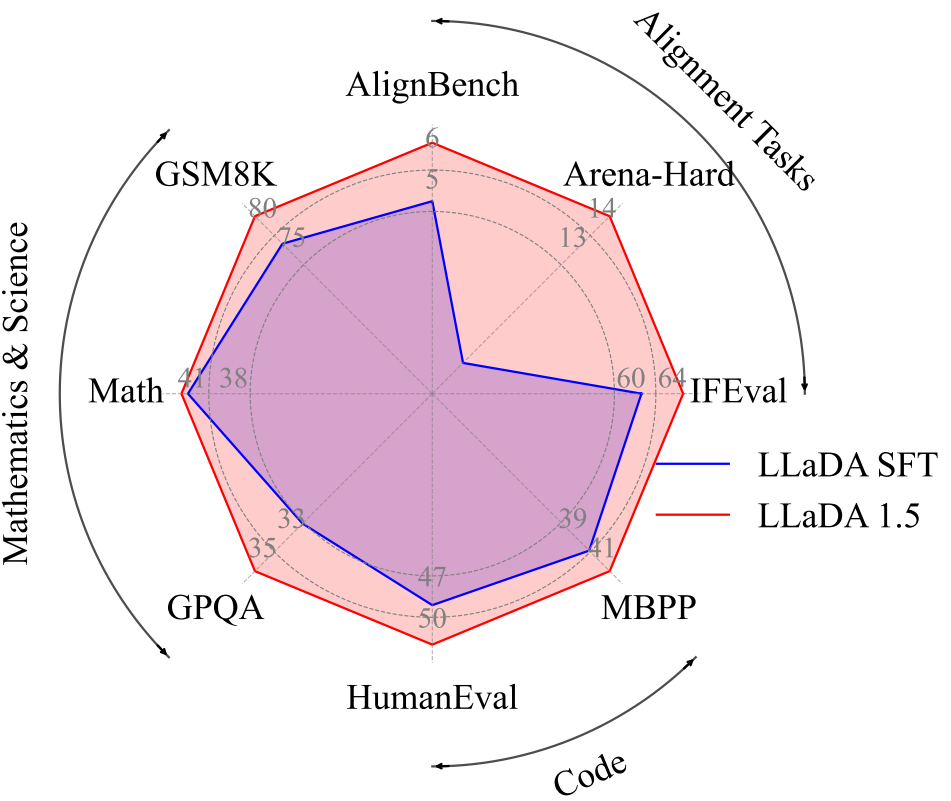

# LLaDA 1.5: Variance-Reduced Preference Optimization for Large Language Diffusion Models

[](https://arxiv.org/abs/2505.19223)
[](https://huggingface.co/GSAI-ML/LLaDA-1.5)

## Introduction

We introduce LLaDA 1.5, a competitive large diffusion language model, trained by variance-reduced preference optimization (VRPO). 

Compared with LLaDA-8B-Instruct, LLaDA 1.5 achieves better performance on a wide range of tasks, including Math, Code, and Alignment tasks.

<div style="display: flex; justify-content: center; align-items: center; width: 100%; margin: 0 auto;">
    
</div>

## Inference

The LLaDA 1.5 model is available on [Huggingface](https://huggingface.co/GSAI-ML/LLaDA-1.5). Please employ the [transformers](https://huggingface.co/docs/transformers/index) to load.

```angular2html
from transformers import AutoModel, AutoTokenizer

tokenizer = AutoTokenizer.from_pretrained('GSAI-ML/LLaDA-1.5', trust_remote_code=True)
model = AutoModel.from_pretrained('GSAI-ML/LLaDA-1.5', trust_remote_code=True, torch_dtype=torch.bfloat16)
```

The model is based on LLaDA-8B-Instruct, you can use the code for [LLaDA-8B-Instruct](https://github.com/ML-GSAI/LLaDA/blob/main/generate.py) to inference.

## Running on RunPod

### Requirements

- **GPU**: A100 (40GB/80GB), RTX 4090 (24GB), or RTX A6000 (48GB) recommended
- **VRAM**: Minimum 24GB (model is ~16GB in bfloat16)
- **Disk**: At least 50GB for model weights

### Quick Start

1. **Create a RunPod Instance**
   - Go to [RunPod.io](https://runpod.io) and deploy a GPU pod
   - Select **RunPod PyTorch 2.x** template with CUDA 12.x
   - Choose a GPU with 24GB+ VRAM

2. **Setup Environment**
   ```bash
   # Clone this repository
   git clone https://github.com/junos-ai-org/LLaDA-1.5.git
   cd LLaDA-1.5

   # Install dependencies
   pip install -r requirements.txt
   ```

3. **Run Inference**
   ```bash
   # Interactive chat mode
   python inference.py --interactive

   # Single prompt
   python inference.py --prompt "What is machine learning?"

   # Demo mode
   python inference.py
   ```

### Alternative: One-Line Setup

```bash
curl -sSL https://raw.githubusercontent.com/junos-ai-org/LLaDA-1.5/main/setup_runpod.sh | bash
```

### RunPod Serverless (Optional)

For production API deployment with pay-per-request billing:

1. **Build and push Docker image**
   ```bash
   docker build -t yourusername/llada-1.5-serverless .
   docker push yourusername/llada-1.5-serverless
   ```

2. **Create Serverless Endpoint**
   - Go to RunPod → Serverless → New Endpoint
   - Select your Docker image
   - Choose GPU type (24GB+ VRAM)
   - Deploy

3. **Call the API**
   ```python
   import runpod
   runpod.api_key = "your_api_key"

   endpoint = runpod.Endpoint("your_endpoint_id")
   result = endpoint.run_sync({"input": {"prompt": "What is AI?"}})
   print(result["response"])
   ```

## Contact

If you have any questions, please feel free to contact fengqizhu@ruc.edu.cn.

## Citation

Please consider cite:

```bibtex
@article{zhu2025llada,
  title={LLaDA 1.5: Variance-Reduced Preference Optimization for Large Language Diffusion Models},
  author={Zhu, Fengqi and Wang, Rongzhen and Nie, Shen and Zhang, Xiaolu and Wu, Chunwei and Hu, Jun and Zhou, Jun and Chen, Jianfei and Lin, Yankai and Wen, Ji-Rong and others},
  journal={arXiv preprint arXiv:2505.19223},
  year={2025}
}
```

## LLaDA Group Wechat QR Code


